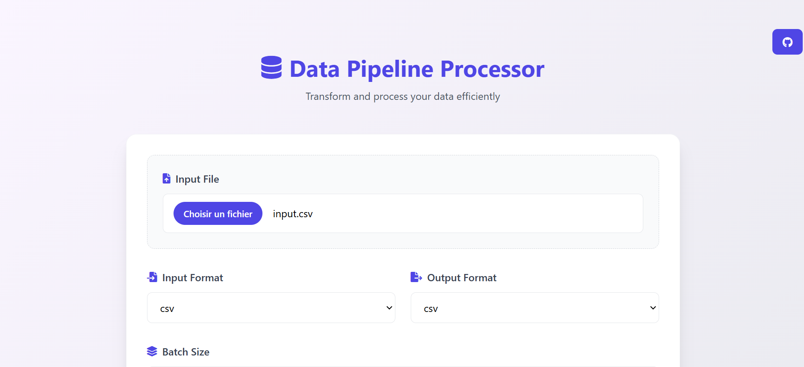

# Functional Data Processing Pipeline

This project is a data processing pipeline written in Python that reads data from a file(CSV|JSON|PARQUET|EXCEL), transforms it, and writes the results to various formats(CSV|JSON|PARQUET|EXCEL) files. 




## Install
```bash
pip install -r requirements.txt
```

## Run

```bash
python app.py
```

**Run the tests:**
```bash
pytest tests/ -v
```
